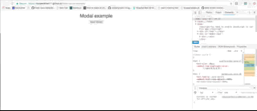

# react-portal-example
Modal example implemented with react16 portals, animated with react-motion

# Demo
https://touqeerkhan11.github.io/react-portal-example/

# 0.1.0 Change Log
Removed TransitionMotion in favor of just motion API: Not sure why I was using that, everything is a bit faster now

Added trivial modal utilities: Like scroll restoration when mounted, disabling background scrolling, body padding when background sroll is disabled, focusing on modal when mounted, and escape button watch to close modal

If there is anyway I can improve this component, please feel free to pass your knowledge (Using this in my app and I would like to improve this)
